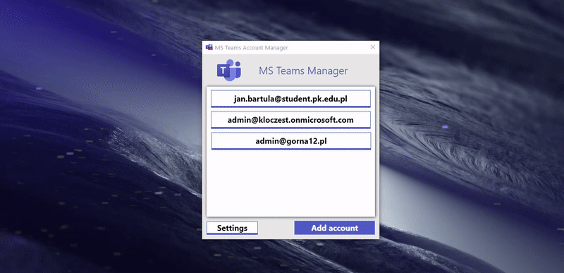

# Microsoft Teams Acconts Manager
GUI app makes it possible to switch between multiple account

## Showcase

## Instuctions
1) Install app
2) Log out current account in MS Teams
3) Run app and name first account ex. *account1@domain.pl*
4) Add more accounts if you want ex. *account2@domain.pl*,*account3@domain.pl* it will take ~30 seconds per account
5) On first run you need to sign in into your account
6) **To switch between accounts don't use Team LogOut** -> run *MS Teams Account Manager* and select account which you want

## How it works?
It makes multiple duplicates of MS Teams application
And it choose backup copy of files which account you want to use - it's simple but works...
